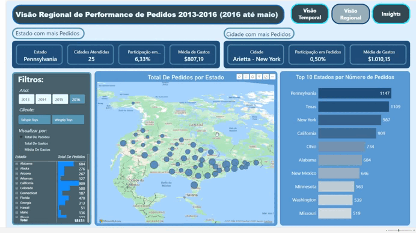

## WWI Orders Performance Analysis

Projeto de análise de performance de pedidos utilizando a base fictícia da WideWorldImporters (WWI).

### Pré-visualização do Dashboard

### O que foi feito
- Extração de dados via SQL Server
- Tratamento e análise dos dados com Python
- Identificação de padrões sazonais e tendências
- Criação de dashboard interativo no Power BI
- 
### Ferramentas
SQL Server, Python (pandas, numpy, matplotlib, seaborn, pyodbc), Power BI

### Observações
Projeto desenvolvido para estudo e portfólio, com foco no fluxo completo de análise de dados, da extração à visualização.

